# StandWay 🏟️
### GenAI Stadium Companion for FIFA World Cup 2026

**StandWay** is a complete, working hackathon submission for **Challenge 4: Smart Stadiums & Tournament Operations** at the "PromptWars: Virtual" Hackathon.

Developed using React, TypeScript, Vite, Tailwind CSS, and Firebase, StandWay leverages the **Groq API** (`llama-3.3-70b-versatile` model) to power a multi-agent routing, translation, and wayfinding engine for sports fans, volunteers, and tournament organizers.

---

## 1. Why StandWay? (Our Approach & Core Differentiator)

Traditional tournament operations builds focus heavily on **organizer-facing heatmaps** and Digital Twin dashboards where AI serves merely as a labels layer over hardcoded rules. 

**StandWay flips the paradigm: we place the Fan persona as primary.** 
By building a mobile-first, highly accessible AI companion, we directly address the attendee journey: from arriving at the correct gate to navigating complex stadium levels, finding sensory rooms, finding local language support, and planning carbon-neutral departures.

### The Visible Reasoning Trail HUD 🧠
The biggest differentiator in StandWay is the **Visible Multi-Agent Reasoning Trail**. Instead of hiding AI decisions in a black-box system prompt, every recommendation StandWay generates shows the exact inputs ingested, the inference logic applied, and the confidence rating of the cooperating sub-agents:
1. **Wayfinding Agent**: Computes the optimal checkpoint path to section/seat.
2. **Crowd Agent**: Flags queue bottlenecks based on live sensor data.
3. **Accessibility Agent**: Re-routes step-free and flags simplified UI modes.
4. **Transit Agent**: Evaluates transit ETAs and plans leave-by time windows.
5. **Sustainability Agent**: Tracks carbon savings compared to taxi baselines.
6. **Language Agent**: Formulates localized copy for multilingual attendees.

---

## 2. Multi-Agent Pipeline & Collaboration Flow

The Orchestrator Agent acts as a central coordinator, executing individual sub-agent logic in a structured pipeline before consolidating the reasoning trail:

```mermaid
graph TD
    A[Fan Query + Ticket + Live Sensors] --> B[Orchestrator Agent]
    B --> C[Wayfinding Agent]
    C --> D[Crowd Agent]
    D --> E[Accessibility Agent]
    E --> F[Transit Agent]
    F --> G[Sustainability Agent]
    G --> H[Language Agent]
    H --> I[Orchestrator Final Synthesis]
    I --> J[JSON Decision Object & Reasoning Trail]
    J --> K[Firestore Audit Logs]
    J --> L[Fan Dashboard / Organizer Console]
    style B fill:#121E36,stroke:#16A34A,stroke-width:2px;
    style I fill:#121E36,stroke:#D4A017,stroke-width:2px;
```



---

## 3. Evaluation Focus Areas & Compliance Matrix

This matrix maps StandWay's core implementations directly to the hackathon evaluation parameters:

| Evaluation Area | Focus Parameter | Implementation / File Path |
| :--- | :--- | :--- |
| **Code Quality** | Centralized Design Tokens | [src/design/tokens.ts](src/design/tokens.ts) |
| **Code Quality** | Separation of Concerns | [src/components/ThreeDBackground.tsx](src/components/ThreeDBackground.tsx) |
| **Security** | API Key Client Gating | [functions/src/orchestrator.ts](functions/src/orchestrator.ts) |
| **Security** | Insecure Storage Warning UI | [src/views/FanView.tsx](src/views/FanView.tsx) (Settings Panel) |
| **Efficiency** | Presentational Lazy Loading | [src/App.tsx](src/App.tsx) (Suspense Wrapper) |
| **Efficiency** | Optimal Bundle Chunking | [vite.config.ts](vite.config.ts) (Split Chunk Setup) |
| **Testing** | 16/16 Pure Agent Unit Tests | [src/tests/agents.test.ts](src/tests/agents.test.ts) |
| **Testing** | Motion Reduction JSDOM Tests | [src/tests/motion.test.tsx](src/tests/motion.test.tsx) |
| **Accessibility** | `prefers-reduced-motion` JS | [src/components/ThreeDBackground.tsx](src/components/ThreeDBackground.tsx) (Angle freeze) |
| **Accessibility** | High Contrast & Scaling | [src/index.css](src/index.css) (`.high-contrast` and `.text-scale` styles) |
| **Alignment** | Complete Operations Console | [src/views/OrganizerConsole.tsx](src/views/OrganizerConsole.tsx) (Decision Feed) |

---

## 4. Technical Architecture & Data Model

```
┌─────────────────────────────────────────────────────────────┐
│                     Vite + React + TS App                   │
│   Fan Dashboard      Volunteer Portal      Organizer Console│
│         │                    │                     │        │
│         └────────────────────┼─────────────────────┘        │
│                              ▼                              │
│                      Zustand App Store                      │
│                              │                              │
└──────────────────────────────┼──────────────────────────────┘
                               │ Real-time Firestore Listeners
                               ▼
┌─────────────────────────────────────────────────────────────┐
│                     Firebase Firestore                      │
│                                                             │
│   /venueState   /decisions   /volunteerTasks   /volunteers  │
└──────────────────────────────▲──────────────────────────────┘
                               │ Callable HTTPS Functions
                               ▼
┌─────────────────────────────────────────────────────────────┐
│                 Firebase Cloud Functions                    │
│                                                             │
│    Orchestrator Agent   ───▶   Groq SDK                     │
│    (Checks local env for       (llama-3.3-70b-versatile)    │
│     GROQ_API_KEY)                                           │
└──────────────────────────────┴──────────────────────────────┘
```

### Firestore Collections Model:
* **`venueState/stadway_stadium`**: Stores live sensor data for all gates (occupancy, queue size), transit lines (ETA, delays), and atmosphere/weather conditions.
* **`decisions/{decisionId}`**: Logs each fan query, the final AI recommendation, the system confidence level, and the audit trail of the cooperating agents.
* **`volunteerTasks/{taskId}`**: A real-time dispatch queue tracking language assistance, first-aid, or mobility support requests.
* **`volunteers/{volunteerId}`**: Active responder profiles detailing languages spoken, current stadium zone, and availability status.

---

## 5. Privacy-by-Design & Security Differentiator 🔒

In compliance with modern stadium security ethics and fan civil liberties:
* **No Facial Recognition / Biometrics**: StandWay intentionally avoids movement tracking or camera identification of individual fans.
* **Aggregate Sensor Analysis Only**: Gates and density maps operate on anonymized counts (occupancy percentage and queue length), preserving user privacy.
* **No PII Beyond Local Profile**: Fan ticket details and names are stored locally in the browser or restricted to standard Firebase security rules.

---

## 6. Security & Proxy Architecture (Groq API Key Protection) 🛡️

To prevent token theft and protect API keys from exposure via XSS or browser memory inspections, StandWay implements a strict **Security Proxy** model:
* **Zero Client-Side Token Leakage**: In production, browser requests never connect directly to the Groq API, and the client browser cannot inject or read API keys from local storage.
* **Serverless Backend Proxying**: All LLM calls are routed through the secure Firebase Cloud Function (`askStadWay`), which securely queries Groq using backend environment variables (`process.env.GROQ_API_KEY`) or secret storage.
* **Sandbox Gating (`DEV_ONLY`)**: For local development and testing, a `DEV_ONLY` boolean gate inside `functions/src/orchestrator.ts` controls local fallback key lookup. If local sandbox mode is active, the UI displays clear security notice alerts. In production, this fallback is disabled to guarantee total key isolation.

---

## 7. Bundle Efficiency & Code Splitting ⚡

StandWay is optimized for fast mobile page load speeds and low bandwidth footprints under busy stadium networks:
* **Compact Footprint**: The minified production build sizes are ~1.00 MB JS and ~48 kB CSS.
* **Presentational Code Splitting**: The canvas wireframe simulation (`ThreeDBackground.tsx`) is separated from main business logic components and lazy-loaded behind a React `Suspense` block:
  ```tsx
  const ThreeDBackground = React.lazy(() => import('./components/ThreeDBackground').then(m => ({ default: m.ThreeDBackground })));
  ```
  This splits the WebGL canvas drawing modules into a tiny **3.97 kB** separate chunk (`ThreeDBackground-*.js`), ensuring that fan dashboard controls load instantly and remain fully interactive without blocking.

---

## 8. How the End-to-End System Works

1. **Sensor Simulator (Presenter Tools)**: Presenters append `?demo=true` to the URL or click **Sensor Simulator** to open the side panel. 
2. **Preset Scenarios**:
   * **Normal Flow**: Smooth gates, minor ETAs.
   * **Gate B Surge**: Gate B occupancy jumps to 92%. Crowd Agent triggers a warning, and Wayfinding Agent reroutes fans from Gate B to Gate A/C.
   * **Transit Delay**: Rain is introduced and Metro Red Line is delayed by 25 mins. Transit Agent detects the bottleneck and guides Zone B ticket holders to take Express Train A instead, while estimating CO₂ savings.
3. **Multi-Step Audit Feed**: The Organizer Console provides a real-time log of every decision StandWay makes and its agent trail, allowing operators to audit AI decisions instantly.

---

## 9. Local Setup & Demo Guide

### Prerequisites
* Node.js v20+ / NPM
* Firebase CLI installed globally (`npm install -g firebase-tools`)

### Installation & Seeding
1. Clone the repository and install root dependencies:
   ```bash
   npm install
   ```
2. Install Cloud Functions dependencies:
   ```bash
   npm --prefix functions install
   ```
3. Set your Groq API Key inside `functions/.env`:
   ```env
   GROQ_API_KEY=your_actual_groq_api_key
   ```
   *(A valid key is pre-seeded in the workspace emulator for local runs).*

### Running Local Emulators & Client
1. Start the Firebase emulator suite (this hosts Firestore, Functions, and Hosting locally):
   ```bash
   firebase emulators:start
   ```
2. In a separate terminal, seed the database with stadium sensor states:
   ```bash
   npm run db:seed
   ```
3. Run the Vite client dev server:
   ```bash
   npm run dev
   ```
4. Open the browser at the shown local URL (usually `http://localhost:5173/?demo=true`) to demo the companion.

---

## 10. Automated Test Suite 🧪

We maintain robust unit, accessibility, and visual motion-reduction tests. Run the full test suite via:
```bash
npm run test
```

### Passing Tests Summary:
* **16/16 tests passed successfully** across:
  * **Crowd Agent**: Verifies surge redirects and queue estimations.
  * **Wayfinding Agent**: Checks step-free routing for wheelchair profiles.
  * **Accessibility Audits**: Audits HTML5 semantics (`header`, `nav`, `main`, `footer`, `aside`) and screen-reader `aria` roles.
  * **Sustainability Agent**: Validates transit carbon metrics.
  * **Language Agent**: Validates multi-language translation bindings.
  * **Motion Reduction Audits**: Verifies `prefers-reduced-motion` settings.

---

## 11. Assumptions & Implementation Notes

* **Maps Integration**: We implemented a high-performance, responsive SVG interactive stadium HUD instead of a paid Google Maps script. This ensures the application works immediately out-of-the-box for judges without requiring credit card configurations.
* **API Key Fallback**: If `GROQ_API_KEY` is not configured or fails, the Orchestrator automatically falls back to a high-fidelity local sensor processing module. This guarantees a stable, fully-responsive dashboard presentation during the live evaluation.
